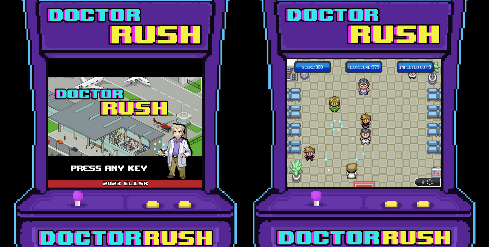

# Doctor Rush

Doctor Rush es el primer videojuego (con un estilo muy retro) que he desarrollado con HTML, CSS y Javascript puro, con el objetivo de mejorar mis habilidades en cada una de estas tecnologías.

## ¡Pruébalo!

https://doctor-rush.vercel.app/

## Screenshots

## Historia
En el aeropuerto de la ciudad ha llegado gente contagiada de un hongo
muy peligroso, y nosotros, el doctor más intrépido e inteligente de la ciudad, 
hemos encontrado la vacuna ¡en nuestras propias verrugas!. 
Nuestro deber será ir al aeropuerto a vacunar con nuestras verrugas
al máximo de personas posibles antes de que salgan e infecten a toda la población.

## ¿Cómo jugar?
El doctor se encuentra en la entrada del aeropuerto y deberá de disparar con las
verrugas a las personas infectadas que intentan escapar. Si tocan al doctor o se 
escapan más de 5 personas, la población se infectará del hongo y perderemos la partida.
Tenemos munición infinita y cada 70 puntos, se obtiene una super verruga.
Cada enemigo necesita 3 verrugas (disparos) o una super verrugas para ser eliminado. 

## Controles
- 'a' o FlechaIzquierda: Ir a la izquierda.
- 'd' o FlechaDerecha: Ir a la derecha. 
- Click izquierdo: Disparar verruga.
- Click derecho: Disparar super verruga.
